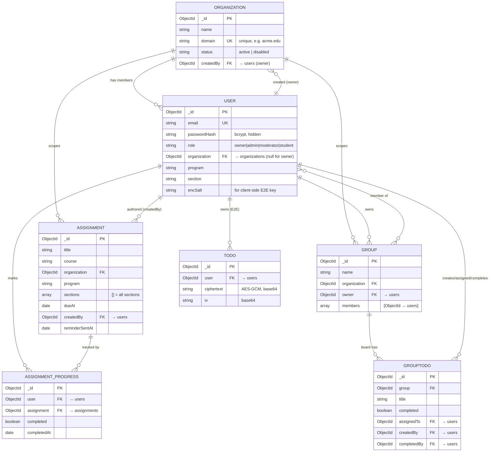

# Data Model (MongoDB)

How data is structured in this project: the collections, their fields, the
relationships between them, and the lifecycle of an organization. Reflects the
Mongoose models in `backend/src/models/`.

## The big idea: document-oriented, not relational

MongoDB stores **documents** (JSON-like) in **collections**. There are no
DB-enforced foreign keys or joins. Each Mongoose model maps to one collection,
and relationships are just **`ObjectId` references** to other documents,
resolved at query time with Mongoose `.populate()` (an app-level join).

> **Important:** referential integrity and tenant isolation are enforced in
> **controller code, not by the database**. Every controller scopes its queries
> by the caller's `organization`; the DB itself would happily let a query cross
> tenants. Any new endpoint must filter by the caller's `organization`.

Mongoose pluralizes + lowercases model names to derive collection names.

| Model | Collection | Purpose |
| --- | --- | --- |
| `Organization` | `organizations` | A tenant (one B-school), keyed by email domain |
| `User` | `users` | Everyone: owner / admin / moderator / student |
| `Assignment` | `assignments` | Deadlines posted by staff, scoped to program/section |
| `Todo` | `todos` | Personal **E2E-encrypted** to-do cards (ciphertext only) |
| `Group` | `groups` | Student collaboration groups |
| `GroupTodo` | `grouptodos` | Shared tasks on a group board |
| `AssignmentProgress` | `assignmentprogresses` | Per-user "I marked this assignment done" |

---

## Collections in detail

### `organizations` — the tenant root

| Field | Type | Notes |
| --- | --- | --- |
| `_id` | ObjectId | PK |
| `name` | String | required |
| `domain` | String | **unique**, lowercased, regex `^[a-z0-9.-]+\.[a-z]{2,}$` (e.g. `acme.edu`) |
| `status` | String | `active` \| `disabled` (indexed) |
| `createdBy` | ObjectId → `users` | the owner who created it |
| `createdAt` / `updatedAt` | Date | timestamps |

Disabling sets `status: 'disabled'` → blocks login for all members but deletes
nothing.

### `users` — all people

| Field | Type | Notes |
| --- | --- | --- |
| `_id` | ObjectId | PK |
| `name` | String | required |
| `email` | String | **unique**, lowercased |
| `passwordHash` | String | bcrypt (cost 12), `select: false` |
| `role` | String | `owner` \| `admin` \| `moderator` \| `student` (indexed) |
| `organization` | ObjectId → `organizations` | indexed; **`null` only for the owner** |
| `program` | String | `PGPM` \| `PGDM` \| `MBA` \| `''` |
| `section` | String | `1` \| `2` \| `3` \| `''` |
| `rollNumber` | String | |
| `phone`, `enrollmentYear` | String | profile fields |
| `encSalt` | String | per-user salt for **client-side** PBKDF2 key derivation (E2E todos). Not secret; the server never sees the password or derived key |
| `mustChangePassword` | Boolean | true until the user sets their own password |
| `isActive` | Boolean | |
| `lastLoginAt` | Date | |

### `assignments` — deadlines

| Field | Type | Notes |
| --- | --- | --- |
| `_id` | ObjectId | PK |
| `title`, `description`, `course` | String | `title`, `course` required |
| `organization` | ObjectId → `organizations` | required, indexed |
| `program` | String | required, indexed (PGPM/PGDM/MBA) |
| `sections` | [String] | **empty array = visible to all sections** in that program |
| `dueAt` | Date | required, indexed |
| `attachmentUrl` | String | optional brief/submission link |
| `createdBy` | ObjectId → `users` | the staff author |
| `reminderSentAt` | Date | set once the cron emails the lead-time reminder, to avoid re-sending |

Compound indexes: `{organization, program, dueAt}` (student queries) and
`{dueAt, reminderSentAt}` (the reminder sweep).

### `todos` — personal board (zero-knowledge E2E)

| Field | Type | Notes |
| --- | --- | --- |
| `_id` | ObjectId | PK |
| `user` | ObjectId → `users` | indexed |
| `ciphertext` | String | base64 AES-GCM ciphertext |
| `iv` | String | base64 init vector |

That's all the server stores — title / notes / due date / board status live
encrypted **inside** `ciphertext`. The server can never read it.

### `groups` — collaboration

| Field | Type | Notes |
| --- | --- | --- |
| `_id` | ObjectId | PK |
| `name`, `description` | String | |
| `organization` | ObjectId → `organizations` | indexed |
| `owner` | ObjectId → `users` | creator/owner |
| `members` | [ObjectId → `users`] | **embedded array of refs** → multikey index (not a separate join collection) |

### `grouptodos` — shared board tasks

| Field | Type | Notes |
| --- | --- | --- |
| `_id` | ObjectId | PK |
| `group` | ObjectId → `groups` | indexed |
| `title`, `notes` | String | |
| `dueDate` | Date | |
| `completed` | Boolean | |
| `assignedTo` | ObjectId → `users` | optional |
| `createdBy` | ObjectId → `users` | |
| `completedBy` | ObjectId → `users` | set when toggled done |

Stored as plaintext (shared with all members, so deliberately **not** E2E).

### `assignmentprogresses` — the User × Assignment junction

| Field | Type | Notes |
| --- | --- | --- |
| `_id` | ObjectId | PK |
| `user` | ObjectId → `users` | indexed |
| `assignment` | ObjectId → `assignments` | |
| `completed` | Boolean | |
| `completedAt` | Date | |

**Compound unique index `{user, assignment}`** → one row per (user, assignment).
This is effectively the many-to-many "has-completed" link table.

---

## Relationships at a glance

- `organizations 1 ──< users` (one org, many members) — via `users.organization`
- `organizations 1 ──< assignments`, `1 ──< groups`
- `users 1 ──< todos`, `1 ──< assignments` (authored, `createdBy`),
  `1 ──< organizations` (created, `createdBy`), `1 ──< groups` (owned)
- `users >──< groups` (**many-to-many**, embedded in `groups.members`)
- `groups 1 ──< grouptodos`; each grouptodo points at up to 3 users
- `users >──< assignments` resolved through `assignmentprogresses` (junction)

---

## ER diagram



### ASCII fallback

```
                         ┌────────────────┐
              created    │  ORGANIZATION  │   (tenant, unique domain)
        ┌───────────────▶│  _id, domain,  │
        │     (createdBy) │  status        │
        │                 └──────┬─────────┘
        │            1 has       │ 1 scopes        1 scopes
        │        ┌───────────────┼──────────────────────┐
        │        ▼               ▼                       ▼
   ┌─────────┐  *  │        ┌──────────────┐        ┌──────────┐
   │  USER   │◀────┘        │ ASSIGNMENT   │        │  GROUP   │
   │ role,   │  (organization)│ program,    │        │ owner,   │
   │ org,    │   authored     │ sections[]  │        │ members[]│◀┐
   │ encSalt │◀───────────────┤ createdBy   │        └────┬─────┘ │ members
   └──┬───┬──┘                └──────┬──────┘        1 has │       │ (M:N,
1owns │   │ marks (progress)         │ tracked by         ▼        │ embedded
      ▼   └──────────────┐           ▼               ┌──────────┐  │ in group)
  ┌────────┐         ┌───────────────────┐           │GROUPTODO │  │
  │  TODO  │         │ ASSIGNMENT_PROGRESS│           │ assignedTo,createdBy,
  │ cipher │         │ (user × assignment)│           │ completedBy ──▶ USER
  │ text   │         │  unique(user,assn) │           └──────────┘──┘
  └────────┘         └───────────────────┘
   (E2E, server          (junction = "user
    can't read)           has marked done")
```

---

## How an organization gets added

Owner-only. Endpoint: `POST /api/organizations`
(`backend/src/controllers/organizationController.js`).

1. **Auth gate** — passes `protect` (valid JWT) then `requireRole('owner')`. Any
   other role → `403`.
2. **Input** — owner submits `{ name, domain }` from the Organizations page
   dialog (e.g. `Acme School`, `acme.edu`).
3. **Normalize + validate** — `domain` is lowercased and a leading `@` stripped;
   must match `^[a-z0-9.-]+\.[a-z]{2,}$`, else `400`.
4. **Uniqueness checks** — reject (`409`) if an org with that `domain` exists, or
   if `admin@<domain>` is already a user.
5. **Create the org doc** → `organizations`: `{ name, domain, status: 'active',
   createdBy: ownerId }`.
6. **Auto-provision the admin** → `users`: `{ name: "<Org> Admin", email:
   "admin@<domain>", role: 'admin', organization: <newOrgId>, mustChangePassword:
   true }`. Password = `env.defaultOrgAdminPassword` (default `Admin@12345`),
   bcrypt-hashed; `encSalt` auto-generated.
7. **Email** — a welcome email with the temp credentials is sent (or logged to
   the console if SMTP isn't configured).
8. **Response `201`** — returns the org plus `adminAccount: { email, password }`
   (so the owner can copy/share it) and `emailDelivered`.

### Lifecycle after creation

- The **admin logs in** (`admin@acme.edu` / `Admin@12345`), is forced to change
  the password, then **adds users** — all of whom must have `@acme.edu` emails
  (the controller rejects mismatched domains). Everything they create carries
  `organization: <orgId>`.
- **Disable** (`PATCH /organizations/:id/status`) flips `status` → members can't
  log in; data stays.
- **Delete** (`DELETE /organizations/:id`) **cascades**: removes that org's
  users, assignments, todos, groups, group-todos, and assignment-progress rows.

---

## Update — RBAC, Semesters & Courses

Three collections were added and three documents changed to support customizable
roles/permissions, semesters, and subject-level (course) moderation.

### New collections

- **`roles`** — a named bundle of permission keys. `{ name, key, description,
  permissions: [String], scope: 'platform'|'organization', organization (null for
  platform roles), isSystem, createdBy }`. Unique `{organization, key}`. Owner
  creates platform roles; admins create org roles.
- **`semesters`** — a term. `{ organization, name, isActive, startedAt, endedAt,
  createdBy }`. Exactly one `isActive` per org; starting a new one archives the
  previous (nothing deleted). `PATCH /semesters/:id` edits the name and date range
  (`startedAt`/`endedAt`) only — activation stays manual via `POST /semesters/start`.
- **`courses`** — a subject in a term. `{ organization, semester, code, title,
  program, credits, hours, sections, proposedFaculty, juniorFaculty,
  moderators: [→ users], createdBy }`. Unique `{semester, code}`. A user in
  `moderators` may author assignments **for that course only**. `credits`/`hours`/
  `sections` are non-negative numbers; faculty fields are free text. Courses can be
  imported in bulk via `POST /courses/bulk` (parsed from the admin's spreadsheet
  client-side, same pattern as `POST /users/bulk`).

### Changed documents

- **`users`** — added `roles: [→ roles]` (custom roles layered on the base role).
  Effective `permissions` are computed per-request as `base-role defaults ∪
  assigned roles' permissions`; course rights come from `courses.moderators`.
- **`assignments`** — `course` changed from a free-text string to `→ courses`, and
  gained `semester: → semesters` (both required, indexed). Visibility is always
  scoped to the active semester.
- **`groups`** — gained `semester: → semesters`, so a new term resets the active
  group list while old groups remain archived under their term.

### Relationships added
- `organizations 1 ──< semesters`, `1 ──< roles`
- `semesters 1 ──< courses`, `1 ──< assignments`, `1 ──< groups`
- `courses >──< users` (moderators, embedded) ; `courses 1 ──< assignments`
- `users >──< roles` (assigned custom roles, embedded array of refs)

Authorization is **permission-based** (`config/permissions.js` catalog →
`utils/permissions.js` `can()`), enforced in controllers/middleware — still
app-level, never by the database.
